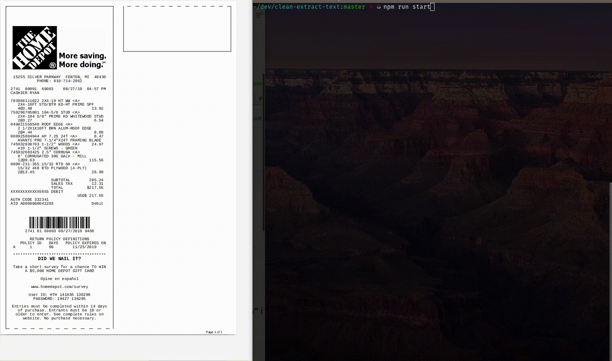

## clean-extract-text

### a simple starter for ocr from png/jpg/pdf files - "with receipt text extraction" in mind

#### clean image(or pdf) text, then use tesseract ocr to extract text from cleaned image.



```bash
git clone https://github.com/jasenmichael/clean-extract-text.git
cd clean-extract-text
npm i
npm run start
```

to clean and extract text from your own png, jpg, or pdf
edit the main.js
```javascript
// edit file 
let file = 'src/receipt.pdf'
// and replace 
let file = '<your-file>.pdf|png|jpg'
```

requires imagemagick
```bash

# on debian linux
sudo apt-get install imagemagick

# on iOS
brew install imagemagick
```


READING PDF files

to convert .pdf files with imagemagick, you must edit the policy.xml file, it is probably located at - /etc/ImageMagick-6/policy.xml

replace
```xml
  <policy domain="coder" rights="none" pattern="PDF" />
```

with
```xml
  <policy domain="coder" rights="read|write" pattern="PDF" />
```


